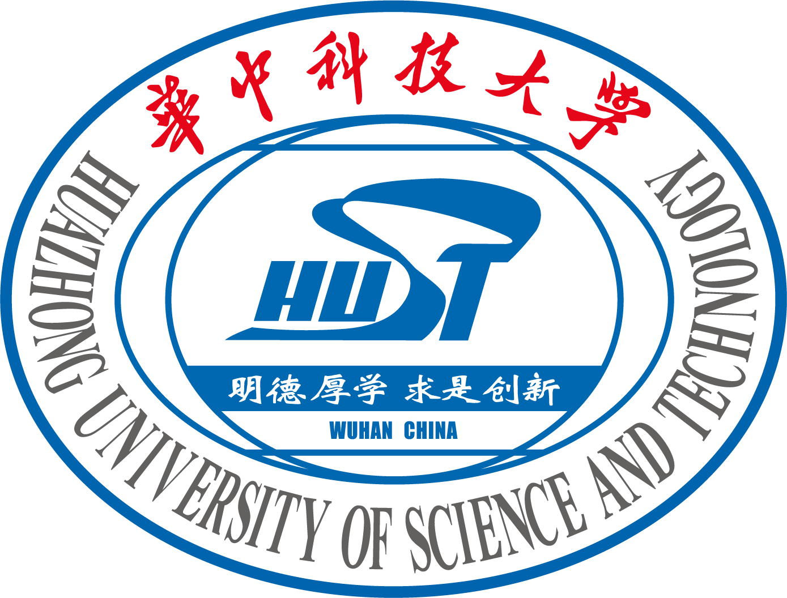

I am a undergraduate student in [Huazhong University of Science and Technology](https://english.hust.edu.cn/), Currently I'm learning Anomaly Samples Generation Based on Diffusion Models and Object Detection. 
I am very fortunate to be advised by [Prof. Yu Zhou](https://faculty.hust.edu.cn/zhouyu9/zh_CN/index.htm) of HUST Robotics Vision Team from [School of Electronic Information and Communications](http://ei.hust.edu.cn/#), Huazhong University of Science and Technology.

Education
======

* 2022 Sep. - 2026 Jun.(expected):

  B.E. in Electronic Information Engineering

  Huazhong University of Science & Technology

Research & Working experiences
======

* 2023 Nov. - Present.: 
  * Research Intern
  * Huazhong Univeristy of Science and Technology
  * Content: 
    * Generative Model for Anomaly Detection 
    * Object Detection 
  * Supervisor: [Prof. Yu Zhou](https://faculty.hust.edu.cn/zhouyu9/zh_CN/index.htm)

Honors
======
  * Scholarship for Academic Excellence
  * Scholarship for Self-improvement
  * Scholarship for Social Welfare
  * Outstanding Communist Youth League Cadre
  * Second Prize in NECCS
  * Honorable Mention in 2024 MCM

Social Service
======

**Student Union**

* 2022 Sep. - 2022.Jun: 
  * **Member** of Rights and Academic Department
  * Huazhong Univeristy of Science and Technology
  * Service:
    * Responsible for the implementation and practice of activities
* 2023 Sep. - 2023.Jun: 
  * **Chairman** of Rights and Academic Department
  * Huazhong Univeristy of Science and Technology
  * Service:
    * Leading the Rights and Academic Department, responsible for the operation of the Student Union